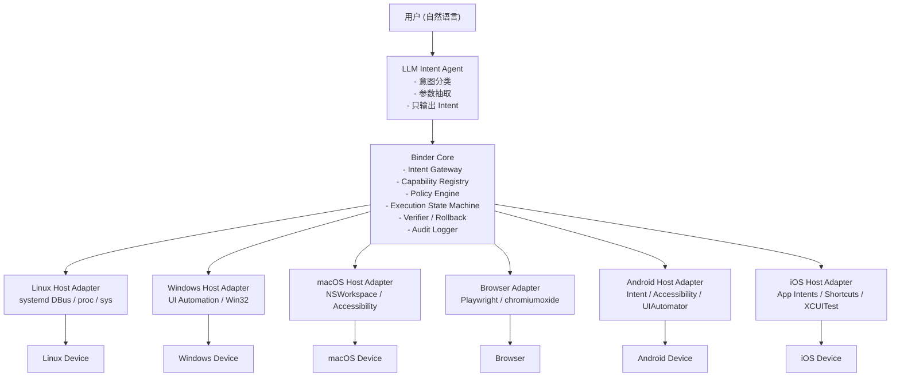
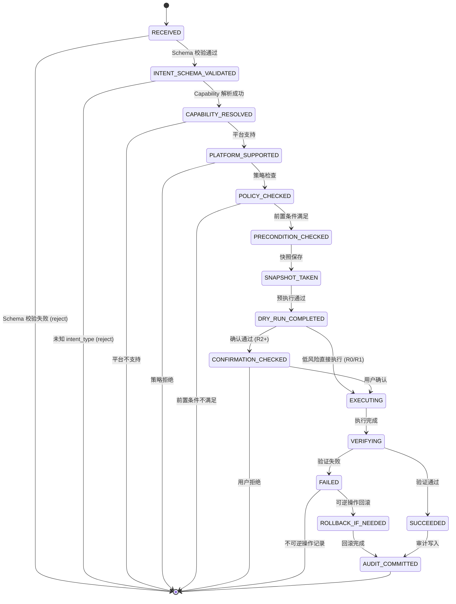

# AI Intent Binder - 技术方案文档

## 1. 总体架构

### 1.1 三层 Agent 架构



### 1.2 核心原则

| 原则 | 实现方式 |
|------|----------|
| LLM 不持有设备凭据 | 凭据只存在于 Host Adapter 本地，Core 不传递凭据给 LLM |
| LLM 不直接调用系统 API | LLM 输出 JSON Intent，由 Core 状态机驱动 Adapter 执行 |
| LLM 不生成可执行命令 | Intent Schema 无 shell/code/command 字段，Schema 校验拒绝 |
| LLM 不决定最终授权 | Policy Engine 独立于 LLM 评估风险并决策 |
| Binder Core 不直接依赖 OS API | 所有平台调用通过 Host Adapter RPC |
| 能力注册制 | Capability Registry 是唯一动作来源，未注册 = 不可执行 |

### 1.3 数据流

```
User Input (Natural Language)
    │
    ▼
┌─────────────────────┐
│  Normalize          │  语言检测、去噪、解析目标设备和平台上下文
└─────────┬───────────┘
          ▼
┌─────────────────────┐
│  Capability Retrieval│  根据平台、角色、设备状态过滤候选 Capability (5-20 个)
└─────────┬───────────┘
          ▼
┌─────────────────────┐
│  LLM Intent Extract │  OpenAI Structured Output → 结构化 Intent JSON
└─────────┬───────────┘
          ▼
┌─────────────────────┐
│  Schema Validation  │  JSON Schema 校验 + enum 校验 + 参数范围校验
└─────────┬───────────┘
          ▼
┌─────────────────────┐
│  Policy Precheck    │  风险等级判定 (R0-R4) + RBAC + ABAC
└─────────┬───────────┘
          ▼
┌─────────────────────┐
│  Execution          │  状态机驱动 → Capability 解析 → Adapter 调用
└─────────┬───────────┘
          ▼
┌─────────────────────┐
│  Verify             │  状态验证 / UI 验证 / Browser 验证
└─────────┬───────────┘
          ▼
┌─────────────────────┐
│  Audit              │  Append-only 审计日志 + hash chain
└─────────────────────┘
```

## 2. Binder Core 设计

### 2.1 模块划分

```
binder-core/
├── intent/
│   ├── validator.rs      # Intent JSON Schema 校验
│   ├── normalizer.rs     # Intent 规范化（补全、默认值）
│   └── router.rs         # Intent → Capability 路由
├── capability/
│   ├── registry.rs       # Capability Registry（内存 HashMap + YAML 加载）
│   ├── resolver.rs       # 根据 intent_type + platform 解析 Capability
│   └── schemas/          # 内嵌 Capability Schema 定义
├── policy/
│   ├── engine.rs         # Policy Engine 主逻辑
│   ├── rbac.rs           # RBAC 角色定义
│   ├── risk.rs           # 风险等级判定
│   └── confirmation.rs   # 确认流程管理
├── execution/
│   ├── planner.rs        # 执行计划生成
│   ├── state_machine.rs  # 执行状态机
│   ├── adapter_client.rs # Adapter RPC 客户端
│   └── lock_manager.rs   # 并发资源锁
├── verifier/
│   ├── state_verifier.rs # 状态验证
│   ├── ui_verifier.rs    # UI 验证
│   └── browser_verifier.rs # 浏览器验证
├── rollback/
│   ├── snapshot.rs       # 执行前快照
│   └── executor.rs       # 回滚执行
└── audit/
    ├── logger.rs         # SQLite append-only 日志
    ├── hashchain.rs      # SHA-256 hash chain
    └── redaction.rs      # 敏感字段脱敏
```

### 2.2 执行状态机



### 2.3 风险等级

| 等级 | 名称 | 示例 | 策略 |
|------|------|------|------|
| R0 | 只读 | 查询网络状态、查询服务状态 | 自动允许 |
| R1 | 低风险可逆 | 调亮度、调音量、打开 App | 自动允许或弱确认 |
| R2 | 中风险可逆 | 重启服务、修改配置 | 用户确认 |
| R3 | 高风险外部影响 | 发消息、发邮件、开门 | 强确认 + 预览 + 二次确认 |
| R4 | 不可逆/危险 | 删除数据、格式化、支付 | 默认禁止或审批流 |

## 3. LLM Intent Agent 设计

### 3.1 设计原则

- LLM 只输出 Intent，不输出 Command
- 使用 OpenAI Structured Outputs（JSON Schema 约束）
- 候选 Capability 先过滤再暴露（最多 20 个）
- LLM 输出的 risk_hint 仅作参考，不被信任

### 3.2 System Prompt 模板

```
你是 Intent Agent。
你只能把用户请求转换为结构化 Intent。
你不能输出 shell、PowerShell、ADB、AppleScript、Python、JavaScript、SQL 或任何可执行命令。
你不能决定授权结果。
你不能绕过用户确认。
你只能选择给定的 capability。
如果用户请求不在 capability 范围内，输出 unsupported。
如果参数不完整，输出 needs_clarification=true。
如果请求涉及外部发送、支付、删除、隐私、设备安全、系统权限，必须标记 high 或 critical risk_hint。
```

### 3.3 输出示例

```json
{
  "intent_id": "intent_001",
  "intent_type": "device.audio.set_volume",
  "target": {
    "platform": "windows",
    "device_id": "local"
  },
  "parameters": {
    "level_percent": 30
  },
  "risk_hint": "low",
  "confidence": 0.92,
  "natural_language_reason": "用户希望进入会议模式，需要降低音量。"
}
```

## 4. 技术选型

### 4.1 Rust 生态选型

| 模块 | Crate | 版本 | 理由 |
|------|-------|------|------|
| 异步运行时 | tokio | 1.x | 成熟稳定，生态最广 |
| 序列化 | serde + serde_json | 1.x | 标准选择 |
| Schema 校验 | jsonschema | 0.18 | 完整 JSON Schema 支持 |
| 数据库 | rusqlite | 0.31 | SQLite 绑定，bundled 模式免安装 |
| HTTP 客户端 | reqwest | 0.12 | 基于 tokio，支持 JSON |
| CLI | clap | 4.x | derive 宏，声明式 |
| RPC | jsonrpsee | 0.23 | JSON-RPC 2.0 服务端/客户端 |
| 日志 | tracing | 0.1 | 结构化日志 |
| UUID | uuid | 1.x | v4 + serde |
| 时间 | chrono | 0.4 | 标准日期时间 |
| 哈希 | sha2 | 0.10 | SHA-256 for hash chain |
| 错误处理 | thiserror + anyhow | 1.x | 标准组合 |
| Windows API | windows | 0.56 | 官方 Microsoft crate |
| macOS API | core-foundation | 0.9 | Core Foundation 绑定 |

### 4.2 浏览器自动化

| 方案 | 评估 |
|------|------|
| chromiumoxide | Rust 原生 Chromium CDP 客户端，通过 `headless_chrome` 控制浏览器 |
| headless_chrome | 低级 CDP 协议实现 |

采用 `chromiumoxide`（高级 API），它封装了 CDP 协议，提供类似 Playwright 的 API。

## 5. Capability Schema 设计

### 5.1 Capability 定义结构

每个 Capability 是一个 YAML 文件，包含：

```yaml
id: device.audio.set_volume
version: 1
description: Set system audio volume by percentage.
risk_level: low
reversible: true
requires_confirmation: false

input_schema:
  type: object
  required:
    - level_percent
  additionalProperties: false
  properties:
    level_percent:
      type: integer
      minimum: 0
      maximum: 100

supported_platforms:
  - os: android
    arch: [arm64]
  - os: linux
    arch: [amd64, arm64]
  - os: windows
    arch: [amd64, arm64]
  - os: darwin
    arch: [amd64, arm64]

bindings:
  linux:
    adapter: binder-host-linux
    method: audio.set_volume
    verifier: audio.get_volume
    rollback: audio.set_volume
  windows:
    adapter: binder-host-windows
    method: audio.set_volume
    verifier: audio.get_volume
    rollback: audio.set_volume
  darwin:
    adapter: binder-host-darwin
    method: audio.set_volume
    verifier: audio.get_volume
    rollback: audio.set_volume

success_criteria:
  - field: audio.volume_percent
    equals_param: level_percent

rollback:
  strategy: restore_previous_value
```

### 5.2 MVP Capability 清单

| ID | 平台 | 风险 | 描述 |
|----|------|------|------|
| binder.health.check | common | R0 | 检查 Binder 健康状态 |
| binder.capability.list | common | R0 | 列出所有可用 Capability |
| system.info.get | common | R0 | 获取系统信息 |
| file.read_confined | common | R1 | 受限文件读取 |
| file.write_confined | common | R2 | 受限文件写入 |
| browser.open_url | browser | R2 | 通过 url_alias 打开页面 |
| browser.verify_text | browser | R0 | 验证页面文本 |
| browser.click_known_element | browser | R2 | 点击已知元素 |
| browser.fill_known_field | browser | R2 | 填写已知表单字段 |
| system.network.status | linux | R0 | 网络状态 |
| system.service.status | linux | R0 | 服务状态 |
| system.process.list | linux | R0 | 进程列表 |
| app.open | windows/darwin | R1 | 打开 App |
| app.close | windows/darwin | R1 | 关闭 App |
| ui.inspect | windows | R0 | 检查 UI 元素 |
| accessibility.permission.check | darwin | R0 | TCC 权限检查 |

## 6. Adapter RPC 协议

### 6.1 Host Adapter 统一接口

所有平台 Adapter 必须实现以下 8 个方法：

```rust
pub trait HostAdapter: Send + Sync {
    /// 描述 Host 信息（OS、架构、版本）
    async fn describe_host(&self) -> Result<HostInfo>;

    /// 列出此 Adapter 支持的所有 Capability ID
    async fn list_capabilities(&self) -> Result<Vec<String>>;

    /// 预检查：判断当前环境是否具备执行条件
    async fn precheck(&self, capability_id: &str, params: &Value) -> Result<PrecheckResult>;

    /// 保存执行前快照（用于回滚）
    async fn snapshot(&self, capability_id: &str, params: &Value) -> Result<Snapshot>;

    /// 干运行（不产生实际效果）
    async fn dry_run(&self, capability_id: &str, params: &Value) -> Result<DryRunResult>;

    /// 执行
    async fn execute(&self, capability_id: &str, params: &Value) -> Result<ExecuteResult>;

    /// 验证执行结果
    async fn verify(&self, capability_id: &str, params: &Value, result: &ExecuteResult) -> Result<VerifyResult>;

    /// 回滚
    async fn rollback(&self, capability_id: &str, snapshot: &Snapshot) -> Result<RollbackResult>;
}
```

### 6.2 RPC 传输

| 平台 | 传输方式 | 地址 |
|------|----------|------|
| Linux | Unix Domain Socket | `/var/run/binder/host-linux.sock` |
| macOS | Unix Domain Socket | `/var/run/binder/host-darwin.sock` |
| Windows | Named Pipe | `\\.\pipe\binder-host-windows` |
| Browser | 同进程 HTTP (localhost) | `http://127.0.0.1:9222` (CDP) |

## 7. 安全设计

### 7.1 Prompt Injection 防护

1. **Schema 硬拒绝**：Intent JSON 没有 shell/code/command 字段
2. **enum 限制**：intent_type 必须是预定义枚举
3. **LLM 输出后校验**：无论 LLM 输出什么，都重新过 Schema 校验
4. **Policy Engine 覆盖**：risk_hint 只是提示，Policy Engine 独立计算 risk_level

### 7.2 审计不可篡改

```
每个 AuditRecord 的 hash = SHA-256(previous_hash + record_data)
```

形成 hash chain，任意一条被修改都会导致后续 hash 断裂。

### 7.3 权限隔离

- binderd 进程不请求 root/管理员权限
- 高权限操作通过 privileged helper 子进程
- Host Adapter 以受限用户运行
- 所有 Adapter 通信走双向 TLS (mTLS) 在 Phase 3+